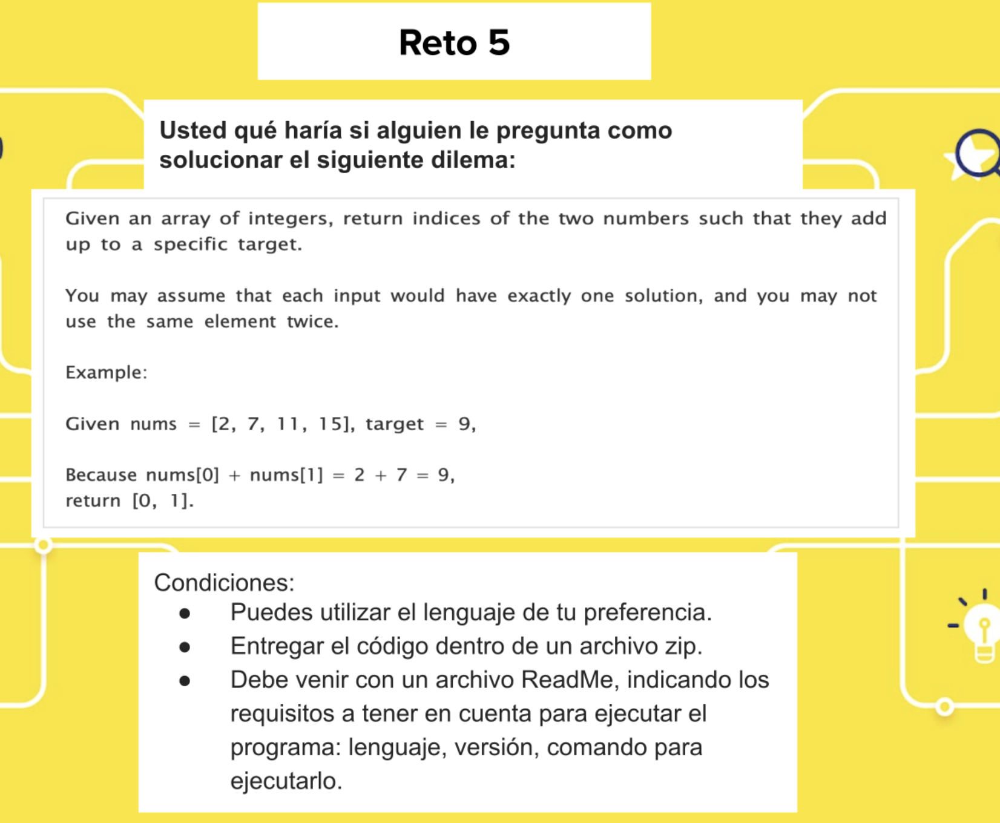
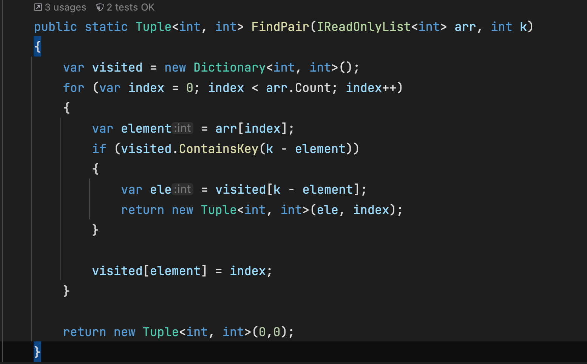
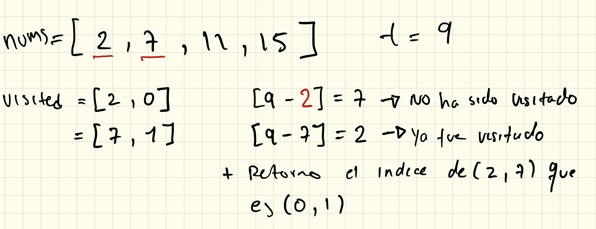

# Problema planteado
Dato el siguiente problema:

Yo lo solucionaria, usando el siguiente algoritmo.
- Esta escrito en C# 9.0 (.net5.0)
- Abrir la solucion con visual studio(windows o Mac) o Rider(windows o Mac).
  - Para ejecutar el metodo de la solucion, debe:  
    - abrir el proyecto SumElements, abrir el archivo Program, dentro encontrara el metodo main. 
    - ejecutar el metodo main.
    - se debe ver en la consola el resultados(Para la entrada dada en el problema).

  `
    found, index: (0, 1)
  `

- Para ejecutar las **pruebas unitarias**:
  - abrir el proyecto TestSumElements.
  - click derecho sobre el proyecto(TestSumElements), Run unit Test.
  - deben pasar las dos pruebas unitarias

Explicacion de la solucion:

